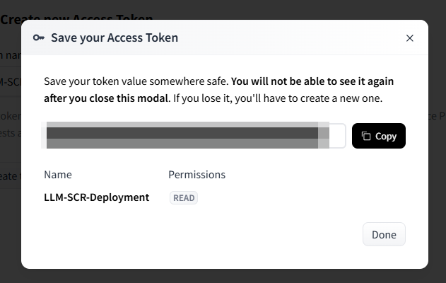
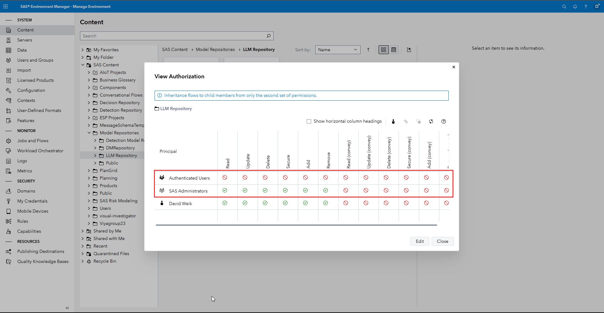

# SAS Agentic AI Accelerator

[TOC]

The SAS Agentic AI Accelerator provides an opinionated method for building AI agents leveraging SAS Viya technology.
It is designed to help users move more quickly from use-case idea to production, utilizing *No/Low/Yes* Code interfaces and full governance as the beating heart of agentic innovation.

It includes:

- The full code + documentation to deploy this in your SAS Viya Environment
- All the integrations that I have built (SAS Studio Custom Steps, a no code prompt engineering UI, SAS Intelligent Decisioning Node, SAS Macros, Postman Collection and so much more)
- Pre-build deployment recipes for LLMs
- Pre-build deployment recipes for embedding models

The accelerator builds only on SAS Viya standard components and thus does not use any unsupported APIs or otherwise undocumented features.

## Troubleshooting

Please refer to the [Troubleshooting-Guide.md](./Troubleshooting-Guide.md) for help if you encounter errors. If you still run into issues, please reach out or [open an issue](https://github.com/sassoftware/sas-agentic-ai-accelerator/issues) in this repository.

## Setup

Please follow these steps carefully and completely. 
In order to complete this setup, you need both the ability to create a new repository in SAS Model Manager (this requires SAS Administrators rights by default), be able to modify a SAS Viya deployment, be able to access a Container Registry, and be able to deploy containers in Kubernetes. Typically, this setup requires both a SAS administrator and a Kubernetes administrator.

In order to be able to run this you will need access to a machine with the following tools available:

- Python with the sasctl>=1.10.3, pandas>=2.1.3 & hugging-face packages installed
- kubectl
- SAS Viya CLI with the authorization, models and identities plugin installed

Recommended setup for Python:

```powershell
# git clone this repository to your host machine
git clone https://gitlab.sas.com/David.Weik/sas-llm-ucf.git
# change into the directory
cd sas-llm-ucf
# create a new Python environment
python -m venv .venv
# Showcasing the activation on Windows, change accordingly
.venv/Scripts/Activate.ps1
# Installing the required packages
pip install sasctl>=1.10.3 pandas>=2.1.3 huggingface-hub[cli]
```

Recommended setup for the SAS Viya CLI:

1.   Download the SAS Viya CLI from the SAS Support page for your operating system - https://support.sas.com/downloads/package.htm?pid=2512.
2.   Next we need to setup up a connection profile in order to be able to connect with your SAS Viya environment:

     ```powershell
     # The example is shown for windows, but all of the options are the same on Linux/MacOS
     ./sas-viya.exe profile init
     # Enter your SAS Viya host (service endpoint), select the output type (I recommend fulljson) and anble ANSI colored output (I recommend yes)
     # If successfull you should see a line like: Saved 'Default' profile to /path/.sas/config.json
     # Next we need to login just to confirm the connection
     ./sas-viya.exe auth login -u username -p password
     # If successfull you shoud see a line like: Login succeeded. Token saved.
     ```

3.   Next we need to install a couple of plugins in order to set everything up correctly - if you want to learn more about the different plugins see the [SAS Documentation](https://go.documentation.sas.com/doc/en/sasadmincdc/default/calcli/n1vth8mtb8ipprn1prz5j26p3nvc.htm):

     ```powershell
     # Installing the required plugins - even if you have setup the CLI before I recommend you do this to ensure the plugins are up to date
     # First up is the authorization plugin
     ./sas-viya.exe plugins install -repo SAS authorization
     # Next we install the identities plugin
     ./sas-viya.exe plugins install -repo SAS identities
     # And then the models plugin
     ./sas-viya.exe plugins install -repo SAS models
     ```

4.   Now the CLI is ready and configured. You may continue.

## Create a Container Registry

It is recommended to create a new container registry used only for this project.
In order to separate this from other container images—or if you are reusing the container registry that is also used for SAS Viya—setting permissions is recommended.

This container registry will be configured as a publishing destination for SAS Viya, more specifically for the SAS Container Runtime (SCR) images.

In Azure, you must create an app registration beside the registry.
This app registration will then get the permissions to push SCR containers to the registy.

Within the app registration, you will need to define a client ID and a secret.
You will use these details later when creating the publishing destination in SAS Viya.

Please see "[How to Publish a SAS Model to Azure with SCR](https://communities.sas.com/t5/SAS-Communities-Library/How-to-Publish-a-SAS-Model-to-Azure-with-SCR-A-Start-to-Finish/ta-p/768714)" for additional information on configuration.

## Create a SAS Container Runtime Publishing Destination

For the creation of the SAS Container Runtime publishing destination, it is recommended to use the [SAS Viya CLI](https://go.documentation.sas.com/doc/en/sasadmincdc/default/calcli/titlepage.htm).
The command detailed below is used to create a publishing destination that is using a Azure Container Registry:

```bash
sas-viya models destination createAzure \
    --name llmACR \
    --description "LLM Azure Container Registry Publishing Destination" \
    --baseRepoURL "<name>.azurecr.io" \
    --subscriptionId <azure-subscription-ID> \
    --tenantId <azure-tenant-ID> \
    --region "<azure-region>" \
    --kubernetesCluster "<kubernetes-cluster>" \
    --resourceGroupName "<resource-group>" \
    --credDomainID "LLMACRCredDomain" \
    --credDescription "Azure LLM ACR Credentials Domain" \
    --clientId <app-registration-client-ID> \
    --clientSecret <app-registration-client-secret> \
    --identityType group \
    --identityId <group-that-should-publish>
```

## Configurations for SCR Deployment

There are example deployment YAMLs provided under *SCR-LLM-Deployment-YAML* that are build for Azure.
These examples make the following assumptions:

- Namespace called *llm* in which the SCR containers will be deployed
- No resource limits are currently imposed (that is why we recommend having a separate node pool for this workload—in non production environments it is recommended to use a spot-instance with a lot of available CPU and RAM, e.g. Standard_D64s_v5)
- The URL endpoint schema looks like this: `host/llm/model_name` (here the container will be reached, which means the full address for a container is `host/llm/model_name/model_name`)


## Deal with Secrets in Creating a SCR Container

Some models have licenses attached to them, which require you to first accept this licenses in order to be able to pull the model weights for deployment.
Hugging Face refers to this models as [gated](https://huggingface.co/docs/hub/en/models-gated).
In order to be able to pull these, you will need to provide a Hugging Face token, which serves as an identifier that ensures that you have accepted the license.

So the next section explains how to obtain a Hugging Face token and integrating it with a build process. For a list of models that require this token please refer to the [./LLM-Definitions/README.md](LLM Definitions README).

### Creating a Hugging Face Token

1.   Head to [Hugging Face](huggingface.co) and Sign Up for a free account.
2.   Click on your profile image in the top right hand corner and click on *Access Tokens* or use this link as a shortcut: https://huggingface.co/settings/tokens.
3.   Click on the *Create new Access Token* button.
4.   As the *Token type* set *Read* and give it a meaningful name like: *LLM-SCR-Deployment* and click the *Create token* button.
5.   In the modal you get a review of all of the information, copy your token (after closing the token value will be gone) and then click *Done*:
     
6.   You are taken back to the *Access Tokens* overview page where you can also delete tokens, invalid & refresh them or add additional once as needed.

Now that we have our token, we can return to the SCR deployment.

### Adding the Secret to the Build Process

If you have secrets that you need within the build process of the SCR container, you can add them as [a secret on Kubernetes](https://kubernetes.io/docs/concepts/configuration/secret/). 

For instance, for the huggingface cli authentication, you will need to add a token that you can create here: 

After you created the token, you can add this token as secret. Therefore, you need to add the token to the namespace:

```bash
kubectl create secret generic huggingface-token --from-literal=huggingfacetoken='*yourToken*' -n *yournamespace*
```

To use the token later in the SAS Model Manager, the token needs to be mounted in the kaniko pod. Therefore the podtemplate of kaniko needs to be changed. Please find further details of the customization in the SAS Model Publish README: `sas-bases\examples\sas-model-publish\kaniko\README.md`.

After you added the yaml files as described in this README to your site-config, you can change the pod template and add the mount of the secret:

```yaml
    containers:
      - name: kaniko
        image: sas-kaniko
        args:
          - --dockerfile=/workspace/Dockerfile
          - --context=/workspace
          - --ignore-path=/usr/bin/newuidmap
          - --ignore-path=/usr/bin/newgidmap
        resources:
          requests:
            memory: "8Gi"
            cpu: "1"
          limits:
            memory: "128Gi"
            cpu: "8"
        volumeMounts: 
          - name: secret-volume
            mountPath: /etc/secret-volume
            readOnly: true
    restartPolicy: Never
    volumes:
      - name: kaniko
        persistentVolumeClaim:
          claimName: sas-model-publish-kaniko
          readOnly: true
      - name: secret-volume
        secret:
          secretName: huggingface-token
```

Now as part of the build process the token is available for access.
In order to log in with the Hugging Face CLI you can use the following line in the `requirements.json`. As this step adds build time, it is recommended to only add it to the models that actually need it:

```bash
huggingface-cli login --token $(cat /etc/secret-volume/huggingfacetoken) 
```

## Setup SAS Model Manager

This script creates the new SAS Model Manager repository and the SAS Model Manager project for you that serve as the home for all LLM related models and prompts.
You must run the script from within the pulled repository.
Make sure that the Python environment you created during the initial setup is still active:

```bash
# Run the setup script - make sure to update the parameter values that are passed into the script
python ./Model-Manager-Setup.py -vs sas-viya-url -u username -p password -rp responsible_party -e endpoint_from_scr_deployment
```

A help function is also available with more information.

### Authorizing the Repository

By default, newly created SAS Model Manager repositories are only authorized for access for the *SAS Administrators* group. Please adjust the access rights as you require it for your environment.
Adding authorization on a group basis is recommended.



Running the Model Manager setup script will produce a file called `sas-viya-cli-commands.txt` which contains the following groups and rules as a template to apply authorization to your environment.
Of course this is just a basic template; please review it carefully and adjust it to your needs.

```powershell
# This script is written for Windows, update the commands accordingly
# Each command comes with a description, please read it and the documentation before running anything

# First a Custom Group is created called LLM Consumers - if you do not want use this group, skip this step and replace the name in subsequent commands
./sas-viya.exe identities create-group --id LLMConsumers --name "LLM Consumers" --description "This group enables a general access to the LLM repository. This group is meant for anybody that requires access to it."
# Add members to the LLM Consumers group
./sas-viya.exe identities add-member --group-id LLMConsumers --group-member-id GroupYouWantToAdd

# Second a Custom Group is created called Prompt Engineers - if you do not want use this group, skip this step and replace the name in subsequent commands
./sas-viya.exe identities create-group --id PromptEngineers --name "Prompt Engineers" --description "This group enables its members to create, update and delete Prompt Engineering projects in the LLM repository"
# Add members to the Prompt Engineers group
./sas-viya.exe identities add-member --group-id PromptEngineers --group-member-id GroupYouWantToAdd

# Create two rules that open up access to the LLM Repository for the LLM Consumers
./sas-viya.exe authorization create-rule -o /folders/folders/folder-uuid -g LLMConsumers -p Read,Add,Remove -d "Enables the LLM Consumers to interact with the LLM repository" --reason "You are not part of the LLM Consumers group"
./sas-viya.exe authorization create-rule --container-uri /folders/folders/folder-uuid -g LLMConsumers -p Read,Add,Update,Remove,Delete -d "Enables the LLM Consumers to interact with the LLM repository" --reason "You are not part of the LLM Consumers group"

# Create a rule to enable the Prompt Engineers to create new projects in the LLM repository
./sas-viya.exe authorization create-rule -o /modelRepository/repositories/repo-uuid -g PromptEngineers -p Read,Add,Create,Update,Remove,Delete -d "Enables the group to create prompt engineering projects in the LLM repository" --reason "You are not part of the prompt engineering group"
```

## Registering LLM Definitions

The folder `LLM-Definitions` contains information on how to add LLMs to the repository in the SAS Model Manager.
Each model is packaged so that it can be deployed using the SAS Container Runtime (SCR).

More on the SCR in the [SAS Documentation](https://go.documentation.sas.com/doc/en/mascrtcdc/default/mascrtag/titlepage.htm).

For registering the models to SAS Model Manager please run the script `register-LLMs.py`.
Ensure that the Python environment that was created during the initial setup is still active:

```bash
# Change into the LLM-Definitions subdirectory
cd ./LLM-Definitions
# Run the script - make sure to update the parameter values that are passed into the script
python ./register-LLMs.py -vs sas-viya-url -u username -p password -rp responsible_party -e endpoint_from_scr_deployment -l llm_1 llm_2
```

A help function is also available with more information.

If you want to add your own LLM to the mix, please use the `_Base_Definition` folder as your template and remember to [contribute back](CONTRIBUTING.md)!
If you are adding a new proprietary model provider please note that the default value for the API_KEY attribute should be set to the name of the provider, and then needs to be added to the LLM Prompt Builder object definition as well.

## Publish the LLMs to the SCR Destination

Once you have registered the LLMs, you can now go ahead and publish the LLMs to the SCR publishing destination. For this the script *LLM-Definitions/publish-LLMs.py* is provided. Make sure that the Python environment that was created during the initial setup is still active:

```bash
# Change into the LLM-Definitions subdirectory
cd ./LLM-Definitions
# Run the script - make sure to update the parameter values that are passed into the script
python ./publish-LLMs.py -vs sas-viya-url -u username -p password -l llm_1 llm_2 -d publishing_destination
```

A help function is also available with more information.

## Registering Embedding Model Definitions

The folder *Embedding-Definitions* contains information on how to add embedding models to the repository in the SAS Model Manager. Each model is packaged so that it can be deployed using the SAS Container Runtime (SCR).

More on the SCR in the [SAS Documentation](https://go.documentation.sas.com/doc/en/mascrtcdc/default/mascrtag/titlepage.htm).

For registering the models to SAS Model Manager please run the script *register-Embedding.py*. Make sure that the Python environment that was created during the initial setup is still active:

```bash
# Change into the Embedding-Definitions subdirectory
cd ./Embedding-Definitions
# Run the script - make sure to update the parameter values that are passed into the script
python ./register-Embedding.py -vs sas-viya-url -u username -p password -rp responsible_party -m embedding_1 embedding_2
```

A help function is also available with more information.

If you want to add your own Embedding to the mix, please use the *_Base_Definition* folder as your template and remember to contribute back! If you are adding a new proprietary model provider please note that the default value for the API_KEY attribute should be set to the name of the provider.

## Publish the Embedding Models to the SCR Destination

Once you have registered the embedding models, you can now go ahead and publish them to the SCR publishing destination. For this the script `Embedding-Definitions/publish-Embedding.py` is provided.
Ensure that the Python environment that was created during the initial setup is still active:

```bash
# Change into the Embedding-Definitions subdirectory
cd ./Embedding-Definitions
# Run the script - make sure to update the parameter values that are passed into the script
python ./publish-Embedding.py -vs sas-viya-url -u username -p password -m embedding_1 embedding_2 -d publishing_destination
```

A help function is also available with more information.

## Deploying the LLM Prompt Builder

This step is not required, but the LLM Prompt Builder is a tool to be able to easily test new prompts across LLMs, compare the results, version your experiments, and turn them into models for further consumption in the platform.

As first step to deploying the LLM Prompt Builder you must first deploy the SAS Portal Framework for SAS Viya.
The documentation for this setup is available in the [project documentation](https://sassoftware.github.io/sas-portal-framework-for-sas-viya/setup).

Now you can add the Prompt Builder UI to the portal by following these steps:

1. Create a new subfolder (the name doesn't matter, but I suggest to use `LLM Prompt Builder`).
2. In that subfolder upload the `llm-prompt-builder.json` file that the **Setup SAS Model Manager** chapter produced; replace any API-keys as needed.
3. Select the file and in the `Details` section under `More > URI`, then copy the `Pathname` (something like `/files/files/a652a4c2-d751-4bf7-8b72-cbce058087fe`.
4. Paste the URI in the below template and save that template as `portal-page-layout.json`:

     ```json
     {
         "general": {
             "name": "Build Prompts",
             "shorthand": "BPT",
             "visible": true,
             "numCols": 1,
             "contact": "david.weik@sas.com"
         },
         "objects": [
             {
                 "name": "LLM Prompt Builder",
                 "uri": "<llm-prompt-builderr.json URI>"
             }
         ]
     }
     ```

5.   Upload the file to the same folder.

You are now set up.

## Calling the LLMs

To make integration into other tools easier the folder `Non-SAS-Viya-Integrations` where you can find a `README.md` that explains the different assets.

In addition in the folder `SAS-Viya-Integrations` you will find a `README.md` that explains the currently provided tools for ease of integration within the SAS Viya ecosystem.

## Logging

The logs from the LLM containers is standardized across all of the different models.
This has been done in order to be able to parse all of the relevant information from the logs and create monitoring on top of them.

In order to make use of these logs, which are written to the standard out of each container, you must collect the logs.
If you do not have an established logging and monitoring process, you can use the simplified logging script provided below.
Otherwise, if you do have an established way of collecting logs, ensure that you can export them to a folder that can be accessed from SAS Studio as a `.log` file (as that it is the input for the parsing utilities).

For more information on how to parse the log and load it into to SAS please take a look at `SAS-Viya-Integrations/Logging-Monitoring`.

### Simplified Logging via a Script

Only use this script if you do not have a more robust process in place.

Create a script—for example `collect_llm_logs.sh`—and ensure that it is executable.
Use the code below and change both the namespace and the log path.
The namespace should be the namespace into which you have deployed the models, and the path needs to be reachable from inside of SAS Studio.
You can also change the logging interval; note that any changes you make here will have to be reflected in the entry for the `crontab`.
The default here also replaces the log file as the assumption is that you pick up the new entries using the parsing script and append (though a full replacement is also supported).

```bash
# Set the script variables for your environment
llm_namspace="llm"
llm_log_path="/viya-share/pvs/sasdata/data/llm/llms.log"
llm_logging_interval="1h"
# Remove the next line to append to the log file isntead
rm $llm_log_path
for pod in $(kubectl get pods -n $llm_namspace -o name); do
  kubectl logs -n $llm_namspace $pod --all-containers --since=$llm_logging_interval >> $llm_log_path
done
```

Next add the following entry to your crontab (`crontab -e`), adjusting your path to the script:

```bash
0 * * * * /viya-share/pvs/sasdata/data/llm/collect_llm_logs.sh
```

This entry will run the log collection script at the top of every hour.

## License & Attribution

Except for the the contents of the `/static` folder, this project is licensed under the [Apache 2.0 License](https://github.com/sassoftware/sas-portal-framework-for-sas-viya/blob/main/LICENSE). 
Elements in the `/static` folder are owned by SAS and are not released under an open source license. SAS and all other SAS Institute Inc. product or service names are registered trademarks or trademarks of SAS Institute Inc. in the USA and other countries. ® indicates USA registration.

Separate commercial licenses for SAS software (e.g., SAS Viya) are not included and are required to use these capabilities with SAS software.

All third-party trademarks referenced belong to their respective owners and are only used here for identification and reference purposes, and not to imply any affiliation or endorsement by the trademark owners.

This project requires the usage of the following:

-   Python, see the Python license [here](https://docs.python.org/3/license.html)
-   Pandas, under the BSD 3-Clause License
-   HuggingFace Hub, under the Apache License 2.0
-   sasctl, under the Apache License 2.0
-   kubectl, under the Apache License 2.0
-   js-tiktoken, under the MIT license - only applicable if you use the provided LLM Usage Report for SAS Visual Analytics

This project is also makes use of the [SAS Portal Framework for SAS Viya](https://github.com/sassoftware/sas-portal-framework-for-sas-viya).

> [!NOTE]  
> These models, for which this project only provides deployment instructions, have their own licenses and dependencies that you should check before deployment.
