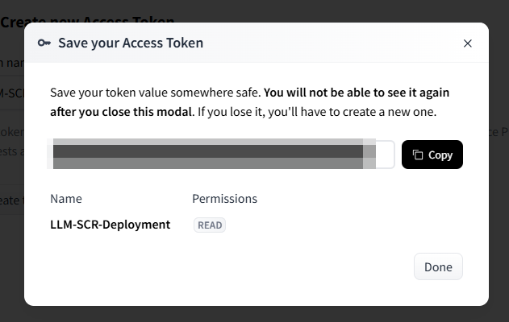

This page details how you should configure your environment in order to publish the SCR containers.

## Hugging Face Token

Some open-source models have licenses attached to them, that require you to first accept these licenses in order to be able to pull the model weights for deployment. Hugging Face refers to these models as **gated**.

In order to be able to deploy these models you will have to provide a *Hugging Face access token*, which serves as an identifier that ensures that you have accepted the license. So first will be a sub-section about how to get a Hugging Face token and then we talk about how that token is integrated with the build process - for a list of models that require this token please refer to the [LLM Definitions page](LLM-Definitions.md).

*Note:* If you don't plan do use any of these models than you can skip this part of the setup process.

### Creating a Hugging Face Token

1.   Head to [Hugging Face](https://huggingface.co/) and Sign Up for a free account.
2.   Click on your profile image in the top right hand corner and click on *Access Tokens* or use this link as a shortcut: https://huggingface.co/settings/tokens.
3.   Click on the *Create new Access Token* button.
4.   As the *Token type* set *Read* and give it a meaningful name like: *LLM-SCR-Deployment* and click the *Create token* button.
5.   In the modal you get a review of all of the information, copy your token (after closing the token value will be gone) and then click *Done*:



6.   You are taken back to the *Access Tokens* overview page where you can also delete tokens, invalid & refresh them or add additional once as needed.

Now that we have our token, we can get back to the SCR deployment.

## Configuration of the Build Kit Pod

This section provides instructions on how to change the Build Kit pod in two ways:
1. Mounting a secret as a volume, this is optional and only required if you use a *gated* model (see previous section).
2. Increasing the ressources for the Build Kit Pod, this is required if you either expect many models to be published at once or if you publish open-source models that have more than 3B parameters.

If you have secrets that you need within the build process of the SCR container, you can add them as a [secret on Kubernetes](https://kubernetes.io/docs/concepts/configuration/secret/).

For instance, for the Hugging Face CLI authentication, you will need to add a token that you can create here: 

After you created the token, you can add this token as secret. Therefore, you need to add the token to the namespace:

```bash
kubectl create secret generic huggingface-token --from-literal=huggingfacetoken='*yourToken*' -n *yourSASNamespace*
```

To use the token later in the SAS Model Manager, the token needs to be mounted in the Build Kit pod. Therefore the podtemplate of Build Kit needs to be changed. Please find further details of the customization in the SAS Model Publish README: *sas-bases/examples/sas-decisions-runtime/buildkit/README.md*.

After you added the yaml files as described in this README to your site-config, you can change the pod template and add the mount of the secret and increase the resource that Build Kit is allowed to consume:

```yaml
    containers:
      - name: buildkitd
        image: sas-buildkit
        args:
          - --dockerfile=/workspace/Dockerfile
          - --context=/workspace
          - --ignore-path=/usr/bin/newuidmap
          - --ignore-path=/usr/bin/newgidmap
        resources:
          requests:
            memory: "8Gi"
            cpu: "1"
          limits:
            memory: "128Gi"
            cpu: "8"
        volumeMounts: 
          - name: secret-volume
            mountPath: /etc/secret-volume
            readOnly: true
    restartPolicy: Never
    volumes:
      - name: secret-volume
        secret:
          secretName: huggingface-token
```

Now as part of the build process the token is available for access. In order to log in with the Hugging Face CLI you can use the following line in the *requirements.json* - as this step adds build time, it is recommended to only add it to the models that actually need it:
```bash
huggingface-cli login --token $(cat /etc/secret-volume/huggingfacetoken) 
```
