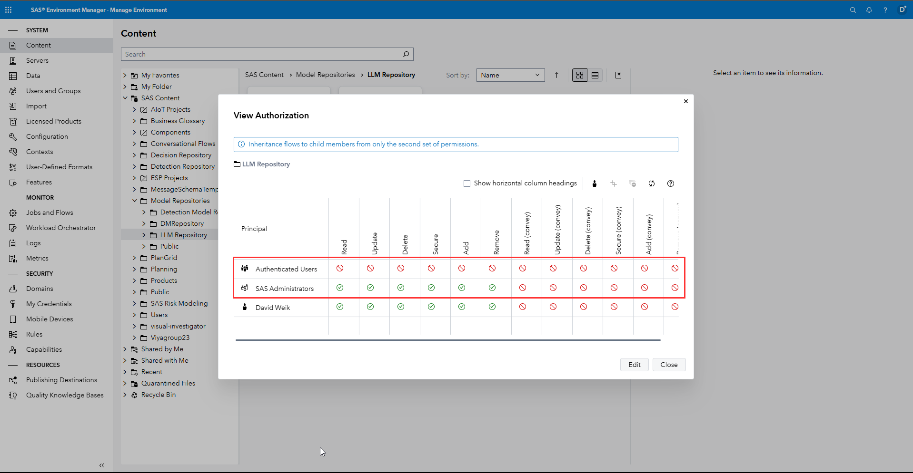

The SAS Agentic AI Accelerator will create an additional model repository in your environment called **LLM Repository**. This repository will be used both to store the project which contains the LLMs, all the different prompting projects, the embedding models and the RAG setups. The project is created using the script *Model-Manager-Setup.py* which is located in the root folder of the repository.

This script creates the new SAS Model Manager repository and the SAS Model Manager projects for you that serve as the home for all LLM and Embedding related models. You need to run the script from within the pulled repository. Make sure that the Python environment that was created during the initial setup is still active:

```bash
# Run the setup script with the help (-h) flag to get more information on each parameter
# Run the setup script - make sure to update the parameter values that are passed into the script
python ./Model-Manager-Setup.py -vs sas-viya-url -u username -p password -rp responsible_party -e endpoint_from_scr_deployment
```

Running this script will produce two additional json files as outputs, that are required for the steps on the page [Setup Additional UIs](Setup-Additional-UIs.md):
- *llm-prompt-builder.json*, this will enable your users to do No-Code Prompt Engineering.
- *rag-builder.json*, this will enable your users to do No-Code RAG pipeline setups.

### Authorizing the Repository

By default newly created SAS Model Manager repositories are only authorized for access for the *SAS Administrators* group, please adjust the access rights as you require it for your environment - it is recommended add authorization on a group basis.



Running the Model Manager setup script will produce a file called *sas-viya-cli-commands.txt* which contains the following groups and rules as a template to apply authorization to your environment. Of course this is just a basic template, please read through it carefully and adjust it to your needs:

```bash
# Each command comes with a description, please read it and the documentation before running anything

# First a Custom Group is created called LLM Consumers - if you do not want use this group, skip this step and replace the name in subsequent commands
sas-viya identities create-group --id LLMConsumers --name "LLM Consumers" --description "This group enables a general access to the LLM repository. This group is meant for anybody that requires access to it."
# Add members to the LLM Consumers group
sas-viya identities add-member --group-id LLMConsumers --group-member-id GroupYouWantToAdd

# Second a Custom Group is created called Prompt Engineers - if you do not want use this group, skip this step and replace the name in subsequent commands
sas-viya identities create-group --id PromptEngineers --name "Prompt Engineers" --description "This group enables its members to create, update and delete Prompt Engineering projects in the LLM repository"
# Add members to the Prompt Engineers group
sas-viya identities add-member --group-id PromptEngineers --group-member-id GroupYouWantToAdd

# Create two rules that open up access to the LLM Repository for the LLM Consumers
sas-viya authorization create-rule -o /folders/folders/folder-uuid -g LLMConsumers -p Read,Add,Remove -d "Enables the LLM Consumers to interact with the LLM repository" --reason "You are not part of the LLM Consumers group"
sas-viya authorization create-rule --container-uri /folders/folders/folder-uuid -g LLMConsumers -p Read,Add,Update,Remove,Delete -d "Enables the LLM Consumers to interact with the LLM repository" --reason "You are not part of the LLM Consumers group"

# Create a rule to enable the Prompt Engineers to create new projects in the LLM repository
sas-viya authorization create-rule -o /modelRepository/repositories/repo-uuid -g PromptEngineers -p Read,Add,Create,Update,Remove,Delete -d "Enables the group to create prompt engineering projects in the LLM repository" --reason "You are not part of the prompt engineering group"
```
