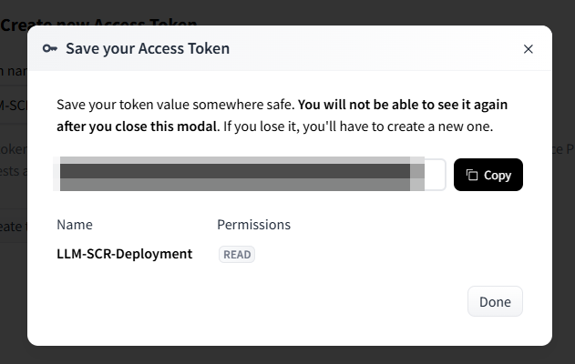

This page details how you should configure your environment in order to publish the SCR containers.

## Hugging Face Token

*Note:* If you don't plan do use any gated open-weight models than you can skip this part of the setup process.

Some open-weight models have licenses attached to them, that require you to first accept these licenses in order to be able to pull the model weights for deployment. Hugging Face refers to these models as **gated** - [Gated Models Documentation](https://huggingface.co/docs/hub/en/models-gated).

In order to be able to deploy these models you will have to provide a *Hugging Face access token*, which serves as an identifier that ensures that you have accepted the license. So first will be a sub-section about how to get a Hugging Face token and then we talk about how that token is integrated with the build process - for a list of models that require this token please refer to the [LLM Definitions page](LLM-Definitions.md).

### Creating a Hugging Face Token

1.   Head to [Hugging Face](https://huggingface.co/) and Sign Up for a free account.
2.   Click on your profile image in the top right hand corner and click on *Access Tokens* or use this link as a shortcut: https://huggingface.co/settings/tokens.
3.   Click on the *Create new Access Token* button.
4.   As the *Token type* set *Read* and give it a meaningful name like: *LLM-SCR-Deployment* and click the *Create token* button.
5.   In the modal you get a review of all of the information, copy your token (after closing the token value will be gone) and then click *Done*:



6.   You are taken back to the *Access Tokens* overview page where you can also delete tokens, invalid & refresh them or add additional once as needed.

Now that we have our token, we can get back to the SCR deployment.

## Configuration of the Build Kit Pod

:::info Build Kit moved in Viya 2025.10

In the SAS Viya platform release **2025.10** the `sas-decisions-runtime` service was merged into **`sas-model-publish`**. The Build Kit assets moved accordingly:

| Up to 2025.09 | From 2025.10 |
| --- | --- |
| `sas-bases/examples/sas-decisions-runtime/buildkit/` | `sas-bases/examples/sas-model-publish/buildkit/` |
| — | `sas-bases/overlays/sas-model-publish/buildkit/` |

This was more than a rename — the way the image build runs changed as well, which affects how Build Kit is customized. If you are on 2025.09 or older, follow the [previous revision of this page](https://github.com/sassoftware/sas-agentic-ai-accelerator/blob/1.1.0/website/docs/Administration-Guide/Configuration-for-Publishing.md).

:::

### How the build runs from 2025.10 onwards

Understanding this matters for both customizations below. There are now **two** components involved:

1. **`sas-buildkitd`** — a long-lived Deployment. This is where the image is actually assembled, meaning every `RUN` step of the generated Dockerfile executes *here*.
2. **A per-publish Kubernetes job** — its `buildkit` container is only a `buildctl` **client**. It ships the build context to the daemon over `tcp://sas-buildkitd:1234` and waits for the result.

Previously the build ran inside the publish job's own pod, so anything mounted into that pod was visible to the build. That is no longer the case.

The pod templates themselves live in `sas-bases/overlays/sas-model-publish/buildkit/` (`update-job-template.yaml` for the SCR build path, `publish-job-template.yaml`). Note that these are SAS-managed overlay files rather than examples you copy into `site-config` — the `examples/` directory now contains only `README.md`, `configuration.env` and `kustomization.yaml`. Customizing the templates therefore requires your own kustomize patch instead of editing a copied file.

For historical reasons several resources under `sas-model-publish` still carry `sas-decisions-runtime-builder` in their names (for example the service account and one of the two PersistentVolumeClaims). Both PVCs are created by the overlay; this is expected and not a leftover.

### Increasing the Build Kit resources

This is required if you expect many models to be published at once, or if you publish open-weight models with more than 3B parameters. **NOTE:** If you only use hosted language models, e.g. via Azure AI Foundry or AWS Bedrock, you do not need to change the sizings here.

Resources are no longer set by editing a pod template. Copy `sas-bases/examples/sas-model-publish/buildkit/` to `site-config/sas-model-publish/buildkit/` and edit `configuration.env`:

```env
buildkitStorageSize=32Gi
buildkitStorageClass=nfs-client
buildkitCpuRequest=1
buildkitMemoryRequest=8Gi
buildkitMemoryLimit=64Gi
buildkitMaxReplicas=3
```

Then add the following to the base `kustomization.yaml` in `$deploy`:

```yaml
resources:
  - site-config/sas-model-publish/buildkit
  - sas-bases/overlays/sas-model-publish/buildkit

transformers:
  - sas-bases/overlays/sas-model-publish/buildkit/buildkit-transformer.yaml
```

These values size the **`sas-buildkitd` daemon** — which, per the section above, is where the build work happens. Two things are worth knowing:

- The PVC requires the `ReadWriteMany` access mode. Storage classes that only support `ReadWriteOnce` (such as Azure `managed-csi-premium`) will fail; use Azure Files, NFS or similar.
- If High Availability is enabled, list `buildkit-transformer.yaml` *after* `enable-ha-transformer.yaml` in the `transformers` block, otherwise the HA transformer overrides `buildkitMaxReplicas`.

If publish volume varies a lot and picking a limit is awkward, SAS ships an overlay that removes the limits entirely — add `sas-bases/overlays/sas-model-publish/buildkit/buildkit-remove-limits.yaml` to the `transformers` block after `buildkit-transformer.yaml`.

See `sas-bases/examples/sas-model-publish/buildkit/README.md` for the full set of options.

### Hugging Face tokens and open-weight models

No Build Kit configuration is needed for open-weight models, including gated ones. Model weights are staged once into a shared Kubernetes volume that every model container reads at run time, so the container build needs no Hugging Face credentials at all.

That approach also keeps images small — only score code and Python dependencies, rather than gigabytes of weights — and lets one staged copy serve every container and replica. See [Serving Open-Weight Models](Serving-Open-Weight-Models.md).

Earlier releases mounted a Hugging Face token into the Build Kit pod so the build itself could authenticate. That is no longer required, and definitions still carrying a `hf login --token $(cat /etc/secret-volume/huggingfacetoken)` step in their `requirements.json` should move to the staged-weights approach.
