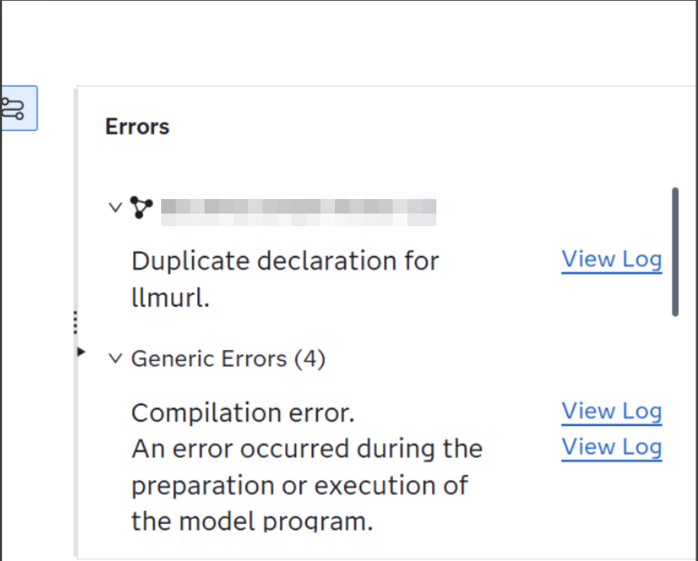

# Troubleshooting Guide

The Troubleshooting Guide tries to provide solution orientied fixes to reported issues. If your issue is not on this please raise an issue or if you already have a solution please contribute it as a pull request.

## SAS Intelligent Decisioning

This part of the troubleshooting guide describes issues that can occur when working with this in SAS Intelligent Decisioning.

### Duplicate declaration for VARIABLE

This error can be encountered during testing within SAS Intelligent Decisioning. Here is how the issue might show up for a variable called **llmurl**:



```SAS
ERROR: Compilation error.
ERROR: Line 167: Duplicate declaration for llmurl.
```

This error occurs when your model (for example the prompt template model) has the same variable twice in its *Variable* tab inside of SAS Model Manager. If that is the case, you have identified the source of the error. In order to fix this, please ensure that you are using the current version of the *Prompt Builder UI* (compare the versions using the https://github.com/sassoftware/sas-portal-framework-for-sas-viya/blob/main/CHANGELOG.md). If you created the model not using that tool, please make sure that model variables are correctly updated when creating new versions of the model.

## Micro Analytic Service

This part of the troubleshooting guide describes issues that can occur when publishing decisions or models that call the LLMs to the SAS Micro Analytic Service (MAS).

### 500 Internal Server Error - EXECUTEMETHOD failed for HTTP POST method with URL

This error occurs because the endpoint under which the LLMs are hosted doesn't have a valid certificate from the standpoint of your SAS Micro Analytic Service. This fix has to be done by an administrator with the ability to patch the SAS Viya deployment - for more information check out the [SAS documentation](https://go.documentation.sas.com/doc/en/mascdc/default/masag/p0kuxnv51taahin1cf23yhr0g23z.htm):

1.   Go to *$BASE_PATH/sasinstall/sas-bases/examples/sas-microanalytic-score/config* and copy the *mas-add-environment-variables.yaml*
2.   Then adjust the yaml in the following way - this assumes that you have deployed the LLMs behind the same ingress as SAS Viya if not you need to point it to your certificate accordingly:

```yaml
---
apiVersion: builtin
kind: PatchTransformer
metadata:
  name: mas-add-environment-variables
patch: |-
  - op: add
    path: /spec/template/spec/containers/0/env/-
    value:
      name: SSLCALISTLOC
      value: /security/trustedcerts.pem
target:
  group: apps
  kind: Deployment
  name: sas-microanalytic-score
```

3.   Add the transformer to your *kustomization.yaml* and apply it.
4.   Check the environment variables of the sas-microanalytic-score pod definition and there under the sas-microanalytic-score container check that the environment variable was added accordingly.
5.   Now rerun your the decision/model call and check that the error has been actually fixed.

## SAS Container Runtime

This part of the troubleshooting guide describes issues that can occur when publishing decisions or models that call the LLMs to a SAS Container Runtime (SCR) publishing destination (independent of AWS, Azure, GCP or Private Docker).

### SSL Error: Missing CA trust list

This error is mostly likely caused by the fact that you are using a certificate for the LLM containers that isn't valid according other SCR containers - this might be because you are using a self-signed certificate or organization signed. This fix has to be done by the person that deploys the container - for more information check out the [SAS documentation](https://go.documentation.sas.com/doc/en/mascrtcdc/default/mascrtag/p0r7reghey2nmsn1lubyxbibzwjh.htm):

```yaml
---
apiVersion: apps/v1
kind: Deployment
metadata:
  name: <CONTAINER>
  namespace: <NS>
spec:
  selector:
    matchLabels:
      app: <APP_NAME>
  template:
    metadata:
      labels:
        app: <APP_NAME>
    spec:
      containers:
      - name: <APP_NAME>
        image: <CONTAINER_REGISTRY>/<CONTAINER>:latest
        resources:
          requests:
            memory: "4000Mi"
            cpu: "1000m"
        ports:
        - containerPort: 8080
          protocol: TCP
        env:
        - name: SAS_SCR_SSL_CERTIFICATE
          value: /ssl/certificate-file.crt
 ... Shortend for brevity
```

Please note that you have to mount the certificate file in a volume to the container!