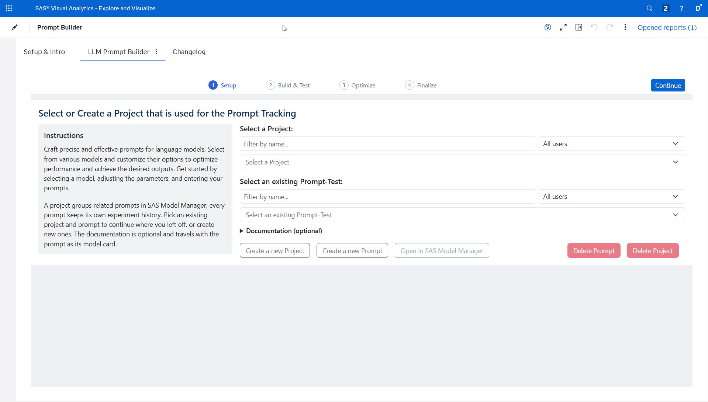
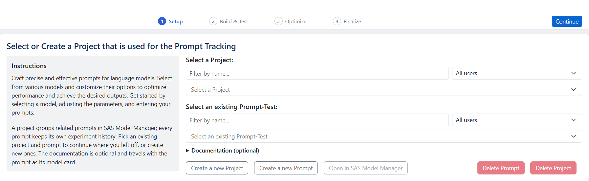
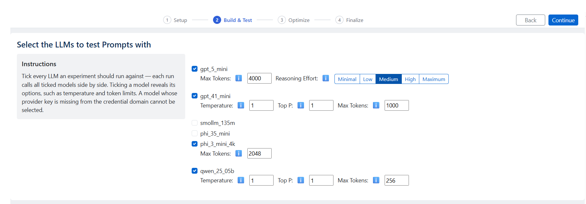
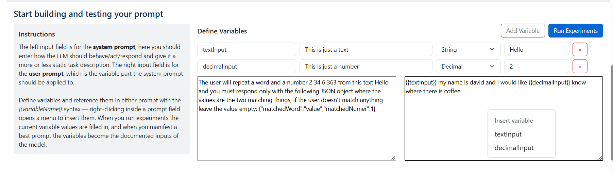
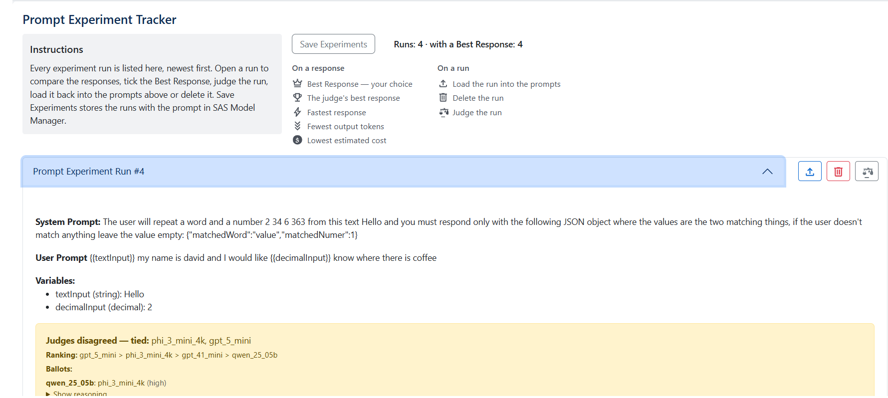
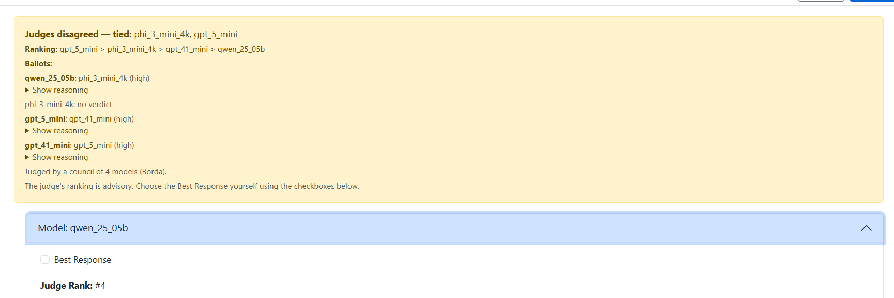
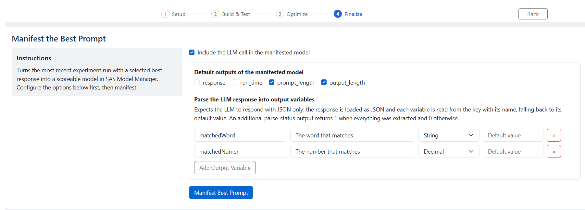

The **LLM Prompt Builder** is a no-code tool for prompt engineers. You test a prompt across several LLMs at once, compare the responses side by side, let an LLM judge which one is best, keep a versioned history of every experiment, and turn the winning prompt into a scoreable model you can use elsewhere on the platform — for example in SAS Intelligent Decisioning. Everything is saved in SAS Model Manager, so your work is governed and shareable.

This guide walks through using the tool. For installing and embedding it in a SAS Visual Analytics report (and the one-time configuration a report author does), see [Deploying the Builder UIs](../Administration-Guide/Setup-Additional-UIs.md).

## The workflow in one minute

You work top to bottom through the page:

1. **Pick a project and a prompt-test** — where this experiment history is stored in Model Manager.
2. **Choose the LLMs** you want to compare and tune their options.
3. **Write your prompt** — a system prompt and a user prompt, with optional variables.
4. **Run the experiment** — every selected model answers in parallel and the responses appear side by side.
5. **Judge the responses** — optionally have a judge model rank them and highlight the strongest.
6. **Mark the best response** and **save** — the run is versioned into Model Manager.
7. **Manifest the best prompt** — turn it into a scoreable model for the rest of the platform.

Nothing is sent to SAS Viya until you have the configuration in place, and no paid model call happens until you press **Run Experiments**.

## Pick a project and a prompt-test

At the top, choose an existing **project** or create one. A project is a Model Manager container that groups related prompt-tests; the Prompt Builder tags the ones it creates so they are easy to find. Inside a project you choose or create a **prompt-test** — this is the thing whose experiment history you are building. Both pickers are **type-to-filter comboboxes** — click one and start typing to narrow the open list live — and each additionally has a "created/modified by" filter, so long lists stay manageable.

Use **Create a new Project** / **Create a new Prompt** to add them without leaving the tool. **Delete Prompt** and **Delete Project** remove them again; before deleting, the tool checks whether any SAS Intelligent Decisioning decisions still use the prompt and warns you, so you do not break a running decision by accident.

Selecting a prompt-test loads its saved experiment runs into the **Prompt Experiment Tracker** further down the page, and brings the most recent run you marked as best straight into the workbench so you can carry on where you left off.

## Choose the LLMs and tune their options

The LLM list shows every model available in your environment's LLM project. Tick each model you want to include in the comparison. When you tick one, its **options** appear — temperature, top-p, top-k, maximum length/tokens and any model-specific settings. Each option has an **ℹ️ info icon**; hover or focus it for an explanation of what the setting does and a sensible range.

You can select as many models as you like; they all run against the same prompt so you get a true side-by-side comparison. Models an administrator has marked as deprecated are hidden from the list.

## Write your prompt

The workbench has two boxes:

- **System prompt** — how the model should behave: its role, tone, task and any rules. This is the mostly-static part.
- **User prompt** — the variable input the system prompt acts on.

### Variables

Real prompts rarely use fixed text. Define **variables** above the prompt boxes — each has a name, an optional description, a type (string or decimal) and a value — then reference them anywhere in either prompt with the `{{variableName}}` syntax. Right-click inside a prompt box to insert a defined variable at the cursor.

When you run an experiment, the current values are filled in before the prompts are sent. Variables are more than a convenience: when you later manifest the best prompt, they become the documented **inputs** of the resulting model, so the model's callers know exactly what to supply.

## Run the experiment

Press **Run Experiments**. The tool sends the resolved prompts to every selected model in parallel and, when they return, shows each model's result in the tracker: the response (rendered as Markdown), the time to respond, and the input/output token counts. Two mechanical flags are added automatically for the run — a ⚡ icon on the **fastest** response and a ⌄ icon on the one with the **fewest output tokens**. Each response is a starting point; speed and length are not quality, which is where judging comes in.

## Judge the responses

Speed and token count do not tell you which answer is actually best. The **Judge the responses** section lets another LLM do that for you.

1. Pick a **judge model**. A deployment can set a default, but you can always override it here. Choose a model that is *not* one of the ones you are comparing where possible — a model tends to over-rate its own style (self-preference bias).
2. Optionally tick **Auto-judge when the experiment finishes** so judging runs by itself after every experiment, or leave it off and judge on demand.
3. Press **Judge this run** on any run in the tracker.

The judge sees all of the run's responses at once, in a shuffled order and under anonymous labels (so position and brand cannot sway it), reasons about them step by step, and returns a ranking. The result appears as a banner on the run: the **winner**, the full **ranking**, a **confidence** level, and the judge's **reasoning** behind a "Show reasoning" toggle. The best-ranked response also gets a 🏆 icon next to the ⚡ and ⌄ icons, and each response shows its **judge rank**.

:::note The judge is advisory
Judging never changes your **Best Response** selection — that stays a decision you make. The judge rank is a signal to help you decide, alongside the responses themselves and the run metrics.
:::

**Include the judge's own response.** By default, if your judge model is also one of the models being compared, its own response is left out of the ranking to avoid self-preference bias. The **Include the judge's own response** toggle overrides that if you want it ranked anyway — its ℹ️ icon explains the trade-off. Judging needs at least two responses to compare, so if excluding the judge would leave only one, either include it or pick a different judge.

The judge model, the include-self setting, the auto-judge setting and the full verdict (including the reasoning) are saved with the run, so loading a run later restores everything exactly as it was judged.

## Mark the best response and save

Tick **Best Response** on the model result you consider best. This is the choice that matters: it is what a manifested model is built from and what downstream monitoring reports on. You can change it at any time.

Press **Save Experiments** to persist the run history to the selected prompt-test in Model Manager. Saving creates a new model **version**, so you keep a full, auditable trail of how a prompt evolved. **Open in SAS Model Manager** jumps straight to the prompt's files there.

### The experiment tracker

Every run you save is listed in the tracker, newest first. For each run you can:

- **Load** it back into the workbench — prompts, variables, the selected LLMs and their options, and the judge configuration are all restored.
- **Delete** it — the remaining runs renumber cleanly.

## Manifest the best prompt

Once a run has a **Best Response**, **Manifest the Best Prompt** turns it into a scoreable model in SAS Model Manager, ready to be consumed elsewhere — most commonly by the *Call LLM* node in SAS Intelligent Decisioning. The variables you defined become the model's input variables (with their descriptions), and the prompt text is baked into the score code.

Two options shape what you get:

- **Include the LLM call in the manifested model.** Off by default: the model returns the request body and endpoint (`llmBody`, `llmURL`) for the *Call LLM* node to execute. On: the model calls the LLM container itself and returns the response and metrics directly.
- **Parse the LLM response into output variables.** If your prompt asks the model to reply with JSON, define the output variables you expect; the model then reads each one from the response, falling back to a default, and adds a `parse_status` output that reports whether everything was extracted.

From here the manifested model behaves like any other model on the platform — see [Deployment of Decisions](../Administration-Guide/Deployment-of-Decisions.md) for using it in a decision flow.

## Optimize the prompt (optional)

When your administrator has [enabled prompt optimization](../Administration-Guide/Enabling-Prompt-Optimization.md), an **Optimize the prompt** section appears after the manifest. It closes the loop *judge → optimise → judge again*: instead of you rewriting the prompt by hand, [DSPy](https://dspy.ai) searches for a better version automatically — using the runs you marked as **Best Response** as the examples of what a correct answer looks like.

1. Pick the **target LLM** the prompt should be optimised for — or, if you are not sure which model to invest in, use **Compare targets…** next to the dropdown first (see [Comparing target models](#comparing-target-models)).
2. Choose the **dataset**. By default it is this prompt's experiments: every saved run with a Best Response becomes one training example — the panel shows how many usable runs you have and requires a minimum (30 by default); the responses you vouched for are treated as *correct*, so make sure they are. Alternatively pick **a governed CAS table** from the cascading **server → caslib → table dropdowns** — the lists come straight from CAS, so only tables that are actually loaded appear. The caslib and table pickers are **type-to-filter comboboxes**: click one and start typing, and the open list narrows live as you type; picking an entry (or pressing Enter on the only remaining match) selects it, and leaving the field without picking keeps your previous selection. The table needs one column per prompt variable plus a `response` column with the reference answer (your administrator can build one with the shipped `Create-Optimization-Dataset.sas` template); the panel additionally checks the table's columns and row count before launching.
3. Choose the **metric**: *exact match* (the optimised prompt must reproduce your Best Responses, ignoring case and surrounding punctuation), *token overlap* (an F1 score over the words shared with the Best Response — partial credit for close answers, a good default for chatty models and longer references), or an *LLM judge* that sees the task and scores whether a response conveys the same answer as your Best Response, using the same rubric as the judging section (accuracy, relevance, completeness, clarity). Pick a judge that differs from the target LLM.
4. Choose the **optimizer**: *Bootstrap few-shot* (the default — keeps your instruction and selects the strongest worked examples to teach with), *MIPROv2* (additionally proposes and trials rewritten instructions, so the optimised system prompt itself can change — it makes noticeably more model calls, which the estimate reflects), or *GEPA* (evolves the instruction from natural-language feedback — it needs a judge model for its reflection step even when the metric is not the judge, and makes the most calls of the three).
5. Press **Run optimization**. The prompt is saved first, then the work runs as a SAS job on the server — the panel shows live progress (dataset loaded, baseline scored, optimising, writing back), and a collapsible **Run log** tracks the job's runtime and milestones. A run makes many model calls and takes several minutes.

When the job finishes you see the metric **before → after**, and the run joins the prompt's **Optimization history** right below — every run stays on the prompt itself (no extra models are created). Expand a run to see its **evolution**: the baseline vs. the optimised system prompt, the few-shot examples the optimizer selected, a per-example before/after table where the answers the optimisation fixed are highlighted, and what the run **spent** — the model calls it made, the token totals, and an estimated cost. **Load as experiment** puts the optimised prompt back into the workbench with its variables and the target LLM pre-selected — run it, judge it against the original (Phase 1/2), and only manifest it if it actually wins. Like judging, optimization is advisory: it never changes your prompt or your Best Response choices by itself.

### Choosing the dataset, metric and optimizer

**When is optimization useful?** DSPy shines when you can say what a *correct answer* looks like but tinkering with the wording hasn't gotten you there: a model that answers correctly but ignores your format, a prompt that works on easy inputs and fails on edge cases, or a task where you suspect a few well-chosen worked examples would help but don't want to pick them by hand. It is *not* the right tool when you have only a handful of examples (the optimizer will overfit them), when no metric can meaningfully score an answer, or when the prompt already scores perfectly — there is nothing left to climb. The job guards that last case for you: if the baseline scores 1.0 on the validation split it **skips the optimization phase** after only the baseline calls, records the run with a note, and suggests harder examples or a stricter metric instead.

**Picking the metric** — the metric *is* the optimization target, so pick the one that actually measures your task:

| Metric | Use when | Watch out for |
| --- | --- | --- |
| **Exact match** | The reference is a single word or a fixed format (categories, codes, yes/no). Case and surrounding punctuation are ignored. | Scores 0 for *any* deviation — chatty models score badly for wording alone. |
| **Token overlap** | Free-form text where the right answer shares its words with the reference (summaries, extractions, short explanations). Partial credit via an F1 score over shared words. | Rewards word overlap, not meaning — a fluent paraphrase with different words scores low. |
| **LLM judge** | The reference can be *said differently* and still be right; meaning matters more than wording. | Each scored example costs an extra judge call; pick a judge model that differs from the target. |

**Picking the optimizer:**

- **Bootstrap few-shot** (default) keeps your instruction untouched and selects worked examples (demos) that teach the model the task. It is fast, cheap and a good first run — if demos alone fix your prompt, stop there.
- **MIPROv2** additionally *rewrites the instruction itself*, proposing and trialling candidates against your metric. It is the stronger tool when the instruction is the problem, at the price of many more model calls (the panel's estimate scales accordingly) — and it needs the `optuna` package in the compute context ([admin guide](../Administration-Guide/Enabling-Prompt-Optimization.md)).
- **GEPA** also rewrites the instruction, but *reflectively* instead of by blind trial: after each round, a **reflection model** (the judge model you pick in the panel) reads *why* the failing answers scored poorly and proposes a targeted improvement. With the **LLM judge** metric that feedback is the judge's own reasoning — the strongest combination, because the optimizer literally learns from the judge's critique; with exact match or token overlap the feedback is a generated expected-vs-produced note. GEPA selects no few-shot examples (the max-examples setting doesn't apply) and makes by far the most model calls of the three — a live 10-example run made roughly 800 calls over about half an hour — so use it when MIPROv2 plateaus or the task needs nuanced instructions. It needs no extra package: its engine ships with dspy itself.

Every finished run reports what it actually spent — the model calls it made per role (target/judge), the token totals, and an **estimated cost** priced with the same per-token/per-second attributes as the run table — in its Optimization-history entry.

### Comparing target models

**Compare targets…** (next to the target dropdown) answers a different question than a single optimization run: *which of my deployed models should I invest in for this prompt?* Pick two or more candidates in the dialog and choose one of two modes:

- **Screen only** (default) scores your *current* prompt on every candidate over the dataset — no optimizer runs, so it costs roughly one call per example per candidate and finishes in minutes. The result is a **ranked table** in the optimization history: quality (by your chosen metric), average model latency per call, calls made, and an estimated cost per candidate — best quality first, lower latency breaking ties. A candidate whose container is unreachable gets flagged instead of failing the whole comparison. Each row offers **Optimize this target**, which pre-selects that model in the panel so the normal single-target run continues from there. Mind the caveat: screening ranks models on the *unoptimised* prompt. A small model that looks weak here can improve dramatically once optimised (demos teach it the format) — treat screening as a way to weed out clearly unsuitable candidates, not as the final verdict between close ones.
- **Also optimize each candidate** runs the panel's configured optimizer on *every* candidate and ranks them by the **optimised** metric — the truthful comparison, at many times the cost (the estimate scales accordingly). Each row then shows that candidate's *before → after* and offers to **load its optimised prompt** into the workbench directly. Because this mode trains per candidate, the full minimum-sample requirement applies (screening only needs 10 examples, with a noise warning below 30).

The recommended flow is both in sequence: **screen first to shortlist, then sweep only the shortlist** — or hand-pick the screening winner and run a normal single-target optimization on it.

### Building a CAS dataset table

The "governed CAS table" dataset source expects this schema (column names are matched **case-insensitively**):

- **One column per prompt variable**, named exactly like the variable in the variables manager. A prompt using `{{word}}` needs a column `word`; a prompt using `{{customer}}` and `{{amount}}` needs both columns.
- If the prompt has **no variables**, a single column `userPrompt` holding the full user prompt of each example.
- A column **`response`** with the reference answer the optimization steers toward. Rows with an empty `response` are skipped.

For example, for a prompt with a `{{word}}` variable:

| word | response |
| --- | --- |
| hot | cold |
| big | small |
| fast | slow |

The table must be **loaded (promoted) into memory** in a caslib the optimization compute context can reach — the panel's table dropdown only lists loaded tables, and the shipped [`Create-Optimization-Dataset.sas`](https://github.com/sassoftware/sas-agentic-ai-accelerator/tree/main/SAS-Viya-Integrations/Prompt-Optimization/Create-Optimization-Dataset.sas) template builds and promotes a correctly-shaped table you can adapt. Two more things to know: the prompt itself (system prompt, user template, variables) still comes from the prompt's last saved run, so **save at least one experiment first**; and before launching, the panel validates the chosen table's columns against your prompt's variables and its row count against the sample minimum, naming exactly what is missing.

## Where your experiments show up for reporting

Everything you save lands in Model Manager as a `Prompt-Experiment-Tracker.json` on the prompt-test. Administrators can roll all of it up into a single `PROMPT_EXPERIMENTS` table for Visual Analytics reporting — including the option values used, the per-run metrics, your best-response choices and the judge's verdict (rank, chosen model and confidence). The tracker files are the source of truth; the report is a convenience view over them.

## A note on API keys

Hosted models (OpenAI, Anthropic, Google, …) need an API key. Keys are **not** typed into the tool or the URL — they are supplied to the object through governed data by whoever sets up the report, so they never end up in a shareable link and access to running paid model calls can be restricted. If a model call fails with an authorization error, that key is missing or not readable for you; ask your administrator. See [Deploying the Builder UIs](../Administration-Guide/Setup-Additional-UIs.md) for the details.

## Where to go next

- [Deploying the Builder UIs](../Administration-Guide/Setup-Additional-UIs.md) — embedding it in a Visual Analytics report and the one-time configuration
- [Model Definition Builder](./Model-Definition-Builder.md) — how the LLMs you test with get added to the environment
- [Deployment of Decisions](../Administration-Guide/Deployment-of-Decisions.md) — using a manifested prompt in SAS Intelligent Decisioning
